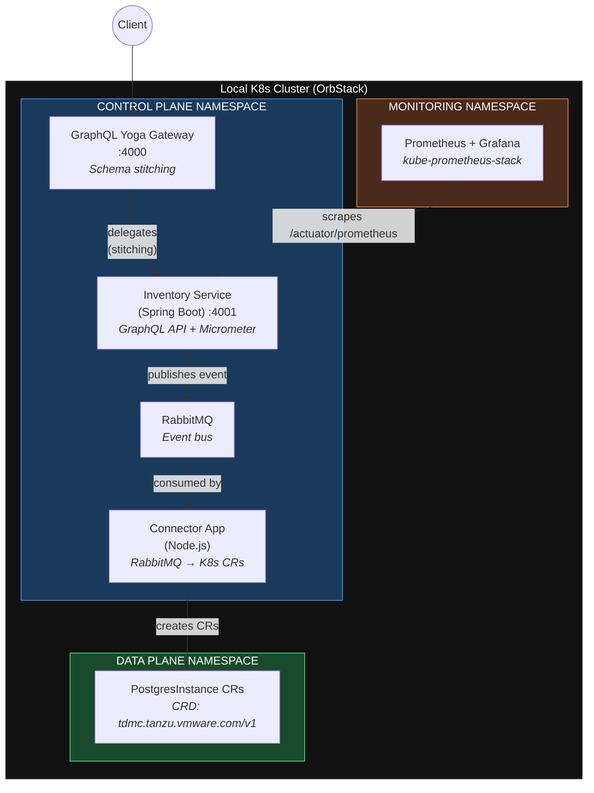

# Mini TDMC — Tanzu Data Management Console (Learning Project)

A simplified implementation of VMware Tanzu Data Management Console architecture, built as a learning exercise to understand cloud-native patterns: Kubernetes, Helm, Terraform, GraphQL schema stitching, event-driven architecture with RabbitMQ, Custom Resources, and observability with Prometheus/Grafana.

## Architecture



### Event Flow
```
Client → Gateway (:4000) → Inventory Service (:4001) → RabbitMQ → Connector → PostgresInstance CRD
```

## How This Maps to Real TDMC

| Mini TDMC Component | Real TDMC Equivalent |
|---------------------|---------------------|
| GraphQL Yoga Gateway | Tanzu Hub GraphQL API |
| Inventory Service | TDMC Control Plane (stores intent) |
| RabbitMQ | RabbitMQ event bus (entry point for all task flows) |
| Connector App | Per-service Connector (Postgres Connector, RabbitMQ Connector) |
| PostgresInstance CRD | Tanzu Postgres Operator CRDs |
| Separate namespaces | Separate K8s clusters (control plane vs data plane) |
| kube-prometheus-stack | Built-in Prometheus/Grafana monitoring |
| Helm charts + Terraform | Infrastructure-as-Code for fleet deployment |

## Tech Stack

| Layer | Technology |
|-------|-----------|
| API Gateway | GraphQL Yoga v5, @graphql-tools/stitch (Node.js) |
| Backend | Spring Boot 3.5, Spring GraphQL, Spring AMQP (Java 21) |
| Event Bus | RabbitMQ 3.13 (TopicExchange, routing keys) |
| Data Plane | Kubernetes Custom Resources (CRD), @kubernetes/client-node |
| Observability | Prometheus, Grafana, Micrometer, ServiceMonitor CRDs |
| Packaging | Helm v4, custom charts with Go templating |
| Infrastructure | Terraform (K8s provider + Helm provider) |
| Container Runtime | OrbStack (Docker + K8s on macOS) |

## Prerequisites

- macOS with [OrbStack](https://orbstack.dev) (Docker + Kubernetes)
- Helm v4: `brew install helm`
- Terraform: `brew tap hashicorp/tap && brew install hashicorp/tap/terraform`
- Java 21: `brew install openjdk@21`
- Node.js 22: `brew install node@22`

## Quick Start

### One command to rule them all

```bash
./scripts/quick-start.sh
```

This runs all setup steps (~3-5 minutes): provisions infrastructure, builds images, deploys all services.

### Or step by step

```bash
./scripts/01-setup-cluster.sh    # Terraform: namespaces + CRD + Helm release
./scripts/02-build-images.sh     # Docker: build all 3 service images
./scripts/03-deploy-all.sh       # K8s: deploy RabbitMQ, Gateway, Connector, Prometheus
./scripts/04-demo.sh             # Demo: create instance, show full E2E flow
./scripts/05-teardown.sh         # Cleanup: remove everything
```

### Demo the full E2E flow

```bash
./scripts/04-demo.sh
```

This creates a PostgreSQL instance through the full pipeline and shows every hop:
`Client → Gateway → Inventory Service → RabbitMQ → Connector → K8s CRD`

### Browser access (started automatically by deploy scripts)

| Service | URL | Credentials |
|---------|-----|-------------|
| Grafana (dashboards + metrics) | http://localhost:3000 | `admin` / `admin` |
| RabbitMQ Management (queues) | http://localhost:15672 | `guest` / `guest` |
| GraphQL Playground (API) | http://localhost:4000/graphql | — |

Port-forwards are started automatically by `03-deploy-all.sh` and `quick-start.sh`. If they die, restart manually:

```bash
kubectl port-forward -n monitoring svc/monitoring-grafana 3000:80 &
kubectl port-forward -n mini-tdmc-control-plane svc/rabbitmq 15672:15672 &
kubectl port-forward -n mini-tdmc-control-plane svc/gateway 4000:4000 &
```

### Useful commands

```bash
kubectl get pods -n mini-tdmc-control-plane     # All services
kubectl get pgi -n mini-tdmc-data-plane          # Custom Resources
kubectl logs -n mini-tdmc-control-plane -l app=connector --tail=10   # Connector logs
kubectl logs -n mini-tdmc-control-plane -l app.kubernetes.io/name=mini-tdmc-inventory --tail=10  # Inventory logs
```

## Event Flow — Step by Step Verification

### Step 1: Create an instance via GraphQL Gateway

Open http://localhost:4000/graphql and run:

```graphql
mutation {
  createInstance(input: {
    name: "demo-postgres"
    serviceType: "POSTGRESQL"
    plan: "large"
  }) {
    id
    name
    serviceType
    plan
    status
    createdAt
  }
}
```

**Expected:** Response with `"status": "PENDING"` and a UUID `id`. The Gateway (:4000) delegated this to the Inventory Service (:4001) via schema stitching.

### Step 2: Verify the event was published to RabbitMQ

Check the Inventory Service logs:

```bash
kubectl logs -n mini-tdmc-control-plane -l app.kubernetes.io/name=mini-tdmc-inventory --tail=5
```

**Expected:** `Published CREATE event for instance <uuid> to tdmc.tasks/instance.create`

Open http://localhost:15672 (guest/guest) → **Queues and Streams** tab → click `tdmc.tasks.instance.create`. You'll see message rates and the queue depth. If the Connector is running, messages are consumed immediately (rate in = rate out).

### Step 3: Verify the Connector processed the event

```bash
kubectl logs -n mini-tdmc-control-plane -l app=connector --tail=5
```

**Expected:**
```
Received event: CREATE for demo-postgres
Created PostgresInstance CR: pgi-<uuid> in mini-tdmc-data-plane
Acknowledged message for demo-postgres
```

### Step 4: Verify the Custom Resource was created in the data plane

```bash
kubectl get pgi -n mini-tdmc-data-plane
```

**Expected:**
```
NAME           PHASE   SERVICE      PLAN    AGE
pgi-xxxxxxxx           POSTGRESQL   large   10s
```

Inspect the full CR:

```bash
kubectl describe pgi -n mini-tdmc-data-plane
```

### Step 5: Query all instances via GraphQL

Open http://localhost:4000/graphql and run:

```graphql
{
  instances {
    id
    name
    serviceType
    plan
    status
    createdAt
  }
}
```

**Expected:** Array containing all instances you've created.

### Step 6: Verify observability in Grafana

Open http://localhost:3000 (admin/admin) → **Explore** (left sidebar) → select **Prometheus** data source.

**Application metrics** — verify Micrometer is exporting:
```
application_ready_time_seconds{application="inventory-service"}
```
**Expected:** A value around 10-15 (Spring Boot startup time in seconds).

**HTTP request metrics** — verify API calls are tracked:
```
http_server_requests_seconds_count{application="inventory-service"}
```
**Expected:** A counter that increases each time you run a GraphQL query.

**JVM memory** — verify JVM health:
```
jvm_memory_used_bytes{application="inventory-service", area="heap"}
```
**Expected:** Heap usage graph (typically 50-150MB).

**K8s dashboards** — go to **Dashboards** → **Kubernetes / Compute Resources / Namespace (Pods)** → select namespace `mini-tdmc-control-plane`. Shows CPU and memory for all pods.

### Full flow summary

```
Client
  → GraphQL Gateway (:4000)           — schema stitching
  → Inventory Service (:4001)         — saves intent, publishes event
  → RabbitMQ (tdmc.tasks exchange)    — routes via "instance.create" key
  → Connector App                     — consumes event from queue
  → PostgresInstance CRD              — created in data-plane namespace
  → (Real TDMC: Operator reconciles)  — provisions actual database
```

## Project Structure

```
mini-tdmc/
├── services/
│   ├── inventory-service/       # Java/Spring Boot — Control Plane API
│   ├── connector-app/           # Node.js — RabbitMQ → K8s CRs bridge
│   └── gateway/                 # Node.js — GraphQL Yoga stitching gateway
├── k8s/
│   ├── base/                    # K8s manifests (deployments, services, RBAC)
│   └── crds/                    # Custom Resource Definitions
├── helm/
│   └── mini-tdmc-inventory/     # Helm chart for Inventory Service
├── terraform/                   # IaC — provisions namespaces + Helm releases
└── docs/
    └── superpowers/specs/       # Design specification
```

## Key Concepts Demonstrated

- **Control Plane / Data Plane separation** — different namespaces (in production: separate clusters)
- **Event-driven architecture** — RabbitMQ with TopicExchange and routing keys
- **GraphQL schema stitching** — gateway-driven composition (no downstream modifications)
- **Kubernetes Operators & CRDs** — extending K8s with custom resource types
- **RBAC** — ServiceAccount + ClusterRole for Connector's K8s API access
- **Observability** — Micrometer → Prometheus → Grafana pipeline with ServiceMonitor CRDs
- **Infrastructure as Code** — Terraform for provisioning, Helm for application packaging
- **Air-gapped deployment** — `helm package` + `docker save/load` workflow
- **Chaos debugging** — OOMKilled, ImagePullBackOff, CrashLoopBackOff diagnosis

## Author

Dan Goriaynov — built as interview preparation for Tanzu Division Senior SWE role.
